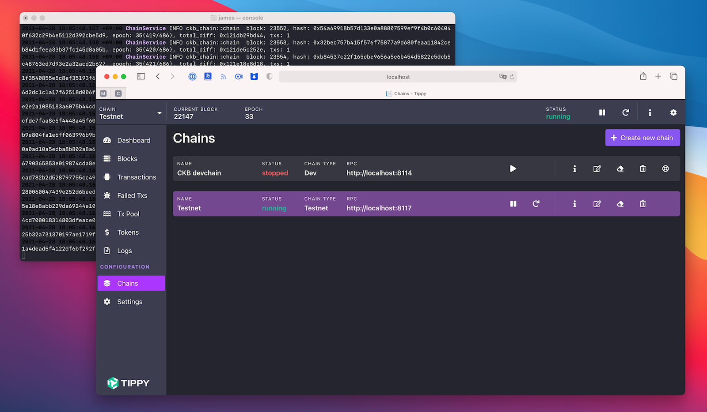

# tippy


> Tippy is still under active development and considered to be a work in progress.



## Getting Started

You can download Tippy binary for your platform of choice from the [releases](https://github.com/nervosnetwork/tippy/releases) page.

Tippy is pre-built as self-contained .Net Core application. You don't have to install .Net Core to run it. If you're running it on Linux or macOS and want to use the Debugger feature, please install debugger dependencies following [this](#install-dependencies) section.

### On Windows:

* Download `tippy-win-x64.zip`
* Extract the zip file (default to `tippy-win-x64`)
* Enter `tippy-win-x64` folder and click `Tippy.exe` to start

### On Linux:

* Download `tippy-linux-x64.tar.gz`
* Extract the tar.gz file (default to `tippy-linux-x64`)
* Make `Tippy` executable: `chmod +x ./tippy-linux-x64/Tippy`
* `cd tippy-linux-x64` then run `./Tippy` to start

### On macOS:

* Download `Tippy.dmg`
* Open the dmg file and drag `Tippy.app` to `/Applications` folder
* From `/Applications` click `Tippy.app` to start

### Tippy Console and UI

While Tippy runs as a console application, it also provides web UI. By default the dashboard UI will be opened automatically, if not you can access it by visiting [http://localhost:5000/Home](http://localhost:5000/Home) from a browser.

## Install Dependencies

Transaction debugger requires `ttyd` and `gdb 10`

For Linux

```bash
brew install ttyd gdb
```

For macOS, must build gdb from source

```bash
brew install gdb --build-from-source
brew install ttyd
```

*Note: debugger is not supported on Windows.*

## Contributing

1. Fetch the codebase: `git clone https://github.com/nervosnetwork/tippy.git`
2. Install [.NET Core SDK](https://www.microsoft.com/net/download) 5.0
3. Install CKB related binary dependencies:
  ```shell
  ./tools/download-binaries.ps1
  ```
  or
  ```shell
  ./tools/download-binaries.sh
  ```
4. Open `Tippy.sln` with Visual Studio 2019 (v16.8 or later), Visual Studio 2019 for Mac (v8.8 or later), or Visual Studio Code
5. Select `Tippy` as startup project for the solution, then start debugging it
6. Browse `http://localhost:5000/home` in your browser

### Add Database Migration

`EF` models are located in `Tippy.Core` project. When making any changes to them and migration is needed, run this

```shell
dotnet ef migrations add [MigrationName] --project src/Tippy.Core --startup-project src/Tippy
```

Or open `Package Manager Console` in Visual Studio, select `Tippy.Core` as `Default project`, then run

```shell
Add-Migration [MigrationName]
```

## Design

Tippy's page design is based on [mazipan/bulma-admin-dashboard-template](https://github.com/mazipan/bulma-admin-dashboard-template).
